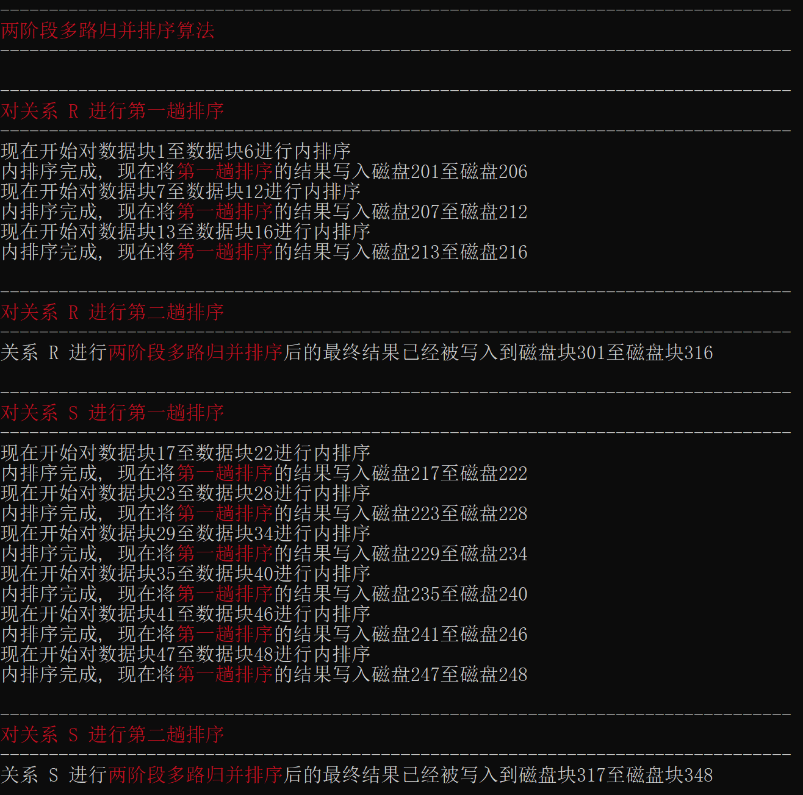

# 2022_HITSZ_DB-Lab5

查询处理算法的模拟实现

哈尔滨工业大学（深圳）2022年秋季学期《数据库系统》课程实验五

## 简介

本次实验要求基于**ExtMem程序库**实现常用的数据库查询处理算法，包括关系的选择、排序、连接操作算法，索引的实现算法，集合的交、并、差操作算法。本人该门课程**实验部分的成绩为满分**。

## 实验环境

- 操作系统：Windows 11 家庭中文版
- C 语言集成开发环境：CodeBlocks 20.03
- C 语言程序库：ExtMem程序库（[extmem-c目录](./extmem-c)下预先提供的 `extmem.c` 文件以及 `extmem.h` 文件）

## 实验内容

### 数据准备：预先建立好的关系R和S的物理存储

- 关系R具有两个属性A和B，其中的全部记录存放在**磁盘块1**至**磁盘块16**中。A、B属性的类型均为int型，A的值域为[100, 140]，B的值域为[400, 500]。
- 关系S具有两个属性C和D，其中的全部记录存放在**磁盘块17**至**磁盘块48**中。C、D属性的类型均为int型，C的值域为[120, 160]，D的值域为[420, 920]。

### 实验任务

| 任务名称                                          | 任务内容                                                     |
| ------------------------------------------------- | ------------------------------------------------------------ |
| 任务一：基于线性搜索的关系选择算法                | 通过**线性搜索**，选出S.C=128的元组，**记录I/O读写次数**，并**将选择结果存放在磁盘上**。（模拟实现**select S.C, S.D from S where S.C=128**） |
| 任务二：两阶段多路归并排序算法（TPMMS）           | 利用内存缓冲区将关系R和S分别排序，并**将排序后的结果存放在磁盘上**。 |
| 任务三：基于索引的关系选择算法                    | 利用任务二的排序结果为关系R或S分别**建立索引文件**，利用索引文件选出S.C=128的元组，并**将选择结果存放在磁盘上**。**记录I/O读写次数**，与**任务一线性搜索**方法的I/O读写次数进行**对比**。（模拟实现**select S.C, S.D from S where S.C=128**） |
| 任务四：基于排序的连接操作算法（Sort-Merge-Join） | 对关系R和关系S计算S.C连接R.A，并**统计连接次数**，**将连接结果存放在磁盘上**。（模拟实现**select S.C, S.D, R.A, R.B from S inner join R on S.C=R.A**） |
| 任务五：基于排序或散列的两趟扫描算法              | 实现并（S∪R）、交（S∩R）、差（S-R）三种集合操作算法中的一种（剩余两种操作算法作为**附加题**实现）。**将结果存放到磁盘上**，并**统计**并、交、差操作后的**剩余元组个数**。 |

实验要求：使用**有限内存（Buffer）**实现上述算法，不可定义大数组装载数据和保存中间结果（即**数组长度必须不大于10**）。

## 实验实现

在文件[utils.c](./extmem-c/utils.c)以及文件[utils.h](./extmem-c/utils.h)中定义了众多工具类函数，这些工具类函数会在接下来各个任务的**核心代码**实现中被调用。关于它们的介绍如下：

| 函数名             | 返回类型 | 功能说明                                                     |
| ------------------ | -------- | ------------------------------------------------------------ |
| getIntFromBlock    | int      | 根据当前所给的缓冲区数据块地址，将原本存储的**字符串转换为整型数**并返回 |
| writeTupleToBlock  | void     | 给定关系的一个记录（即元组），将这对**整型数转换回字符串**，写回到**缓冲区数据块**中 |
| writeTupleToDisk   | void     | 当缓冲区数据块中的**元组装满**后，将这个**数据块写入到磁盘**中 |
| tpmms_first_stage  | void     | 两阶段多路归并排序的**第一阶段**：将记录划分成若干子集并对每一个子集进行内排序 |
| tpmms_second_stage | void     | 两阶段多路归并排序的**第二阶段**：让子集间进行归并排序       |
| is_equal           | int      | 用于判断两个元组的**所有属性是否对应相等**：若是，则返回1；否则，返回0 |
| is_smaller         | int      | 用于判断所给的两个元组**哪一个值更小**（第一个属性相等时会比较第二个属性）：若输入的第一个元组更小，则返回1；否则，返回0 |
| compare_tuple      | int      | 用于判断所给的两个元组**哪一个值更大**（第一个属性相等时会比较第二个属性）：若输入的第一个元组更大，则返回1；否则，返回0 |
| swap_tuple         | void     | 根据当前所给两个元组的地址，**交换两个元组在数据块中的位置** |

### 任务一：基于线性搜索的关系选择算法

#### 设计思路

本任务需要使用**线性搜索**的方式从关系S中找出满足S.C=128的元组。由于所要求的查找方式是 **“线性搜索”** ，因此直接遍历全部的关系S的记录，筛选出其中属性C的值为128的元组，再将其**写入到新的磁盘块**中并进行**计数**，就可以完成该任务了。值得注意的是，一个数据块只能存放7个元组（最后一个位置需要存放**后继地址**）。因此在调用 `writeTupleToDisk` 函数**将装满了元组的数据块写回到磁盘块时**，必须要先等待 `record_count` 大于0、 `record_count` 能被7整除（刚好装满一个缓冲区数据块）且又有新的符合条件元组被发现了（所以缓冲区数据块不够装要被写入磁盘）。这就导致**装填了最新发现的元组的数据块**未能被及时写入到磁盘块中。因此，当遍历 `index` 的循环结束以后，需要额外调用一次函数 `writeBlockToDisk` 将这部分元组也一起写回到磁盘块中。

#### 核心代码

```c
    int record_count = 0, index = 17;

    while (index <= 48)
    {
        if ((blk_read = readBlockFromDisk(index, buf)) == NULL)
        {
            perror("Reading Block Failed!\n");
            return;
        }
        printf("读入数据块%d\n", index);
        for (int i = 0; i < 7; i++)
        {
            int x = getIntFromBlock(blk_read + i * 8);
            int y = getIntFromBlock(blk_read + 4 + i * 8);
            if (x == c_value)
            {
                if ((record_count != 0) && (record_count % 7 == 0))
                {
                    // record_count 不为 0 且为 7 的倍数时, 说明已经写满了一个缓冲区数据块
                    writeTupleToDisk(blk_write, buf, output_disk_num, PRINT);
                    output_disk_num++;
                }
                writeTupleToBlock(blk_write + 8 * (record_count % 7), x, y);
                printf("(X=%d, Y=%d)\n", x, y);
                record_count++;
            }
        }
        index++;
        freeBlockInBuffer(blk_read, buf);
    }

    // 将剩余记录(不超过 7 个的那部分)写入磁盘
    if (writeBlockToDisk(blk_write, output_disk_num, buf) != 0)
    {
        perror("Writing Block Failed!\n");
        return;
    }
    printf("注：结果写入磁盘：%d\n", output_disk_num);

    printf(RED "满足选择条件的元组一共有%d个。\n" COLOR_NONE, record_count);
    printf(RED "IO读写一共有%lu次。\n" COLOR_NONE, buf->numIO);
    freeBuffer(buf);
```

### 任务二：两阶段多路归并排序算法（TPMMS）

#### 设计思路

任务二要求对关系R、S进行两阶段多路归并排序。因此，完成本题的关键之处就在于TPMMS两个阶段的函数 `tpmms_first_stage` 和 `tpmms_second_stage` 的实现。实现好之后，无论是关系R还是关系S，依次调用这两个阶段的函数，修改传入的参数以使之适配相应的情况（如读入的磁盘块编号、写出的磁盘块编号等），即可完成归并排序。

第一趟排序，即函数 `tpmms_first_stage` 的实现：本人在设计时让**分组大小为6**（**即单个分组最多包含6个数据块**），根据读入的磁盘块编号确定记录的**总块数**，再由此确定**分组总数**。然后，可根据当前的分组编号、组内的数据块编号、数据块内的元组编号**精确定位到每一个记录**。一旦能够实现对全体记录的顺序遍历，就可以使用**冒泡排序**的方式两两**比较、交换**不符合预期升降顺序的记录，最终使得每个分组**逐渐调整为有序状态**。将得到的第一趟排序结果写入到磁盘中，以便于在第二趟排序时读入进行处理。

第二趟排序，即函数 `tpmms_second_stage` 的实现：与第一趟排序相类似，同样先确定好记录的**总块数、分组总数**。由于每个分组在经过第一趟排序后已经**组内有序**，可以进行归并排序，每次选出一个值最小的元组写出到磁盘块中。设置 `min_group` 、 `min_offset` 等变量记录下这个最小元组所在的分组编号、块内偏移量。当需要将元组写入保存到写数据块时，就可以通过这个分组编号 `min_group` 、组内偏移量 `min_offset` 定位到最小元组（精确地址应当为 `blk_read[min_group] + min_offset` ），及时完成归并结果的保存。当产生一个新的最小元组时，同样需要更新 `min_group` 、 `min_offset` 。由此，完成第二趟的归并排序，并输出归并结果到磁盘中。

#### 核心代码

##### 函数 `tpmms_first_stage` 的核心代码

```c
    // 常量 TPMMS_MAX_GROUP_SIZE 的值为 6 , 即单个分组最多包含 6 个数据块
    unsigned char *blk_read[TPMMS_MAX_GROUP_SIZE];

    int index_blk = disk_num_start;
    int group_num = (disk_num_end - disk_num_start + 1 + TPMMS_MAX_GROUP_SIZE - 1) / TPMMS_MAX_GROUP_SIZE; // 分组总数向上取整
    for (int group = 0; group < group_num; group++)
    {
        int last_index_blk = index_blk;
        int count = 0;
        while ((count < TPMMS_MAX_GROUP_SIZE) && (index_blk <= disk_num_end))
        {
            // 循环结束后, count 的值应当为当前分组的实际数据块数
            if ((blk_read[count] = readBlockFromDisk(index_blk, buf)) == NULL)
            {
                perror("Reading Block Failed!\n");
                return;
            }
            // printf("读入数据块%d\n", index_blk);
            index_blk++;
            count++;
        }

        printf("现在开始对数据块%d至数据块%d进行内排序\n", last_index_blk, index_blk - 1);

        int max_tuple_num = TPMMS_MAX_GROUP_SIZE * 7;
        // 对当前分组中的所有元组进行冒泡排序, 所需的外层循环数不会超过单个分组包含的最大元组数
        for (int i = 0; i < max_tuple_num; i++)
        {
            for (int j = 0; j < count; j++)
            {
                // 偏移量必须小于 56, 因为后 8 位要存放后继数据块地址
                for (int offset = 0; offset < 56; offset += 8)
                {
                    unsigned char *ta, *tb;
                    ta = blk_read[j] + offset;
                    // 偏移量为 48 时, 说明 ta 是当前数据块的最后一个元组, 因此要和下一个数据块(如果有的话)的第一个元组进行比较
                    if (offset == 48)
                    {
                        if (j == count - 1)
                        {
                            continue;
                        }
                        tb = blk_read[j + 1];
                    }
                    // 否则, ta 直接和当前数据块中的下一个元组进行比较
                    else
                    {
                        tb = ta + 8;
                    }
                    if (compare_tuple(ta, tb))
                    {
                        swap_tuple(ta, tb);
                    }
                }
            }
        }

        printf("内排序完成, 现在将" RED "第一趟排序" COLOR_NONE "的结果写入磁盘%d至磁盘%d\n", output_disk_num, output_disk_num + count - 1);

        for (int i = 0; i < count; i++)
        {
            // 补充后继地址
            writeTupleToBlock(blk_read[i] + 56, output_disk_num + i + 1, TUPLE_END_FLAG);
            if (writeBlockToDisk(blk_read[i], output_disk_num + i, buf) != 0)
            {
                perror("Writing Block Failed!\n");
                return;
            }
            // printf("注：结果写入磁盘：%d\n", output_disk_num + i);
        }
        output_disk_num += count;
    }
```

##### 函数 `tpmms_second_stage` 的核心代码

```c
    int group_num = (disk_num_end - disk_num_start + TPMMS_MAX_GROUP_SIZE) / TPMMS_MAX_GROUP_SIZE;
    // group_disk_index[group] 保存的是当前分组比较到的磁盘块编号
    // 由于 R 和 S 分别有 16, 32 个数据块, 故最多有 6 个分组
    int group_disk_index[6];
    for (int group = 0; group < group_num; group++)
    {
        group_disk_index[group] = disk_num_start + TPMMS_MAX_GROUP_SIZE * group;
        if ((blk_read[group] = readBlockFromDisk(group_disk_index[group], buf)) == NULL)
        {
            perror("Reading Block Failed!\n");
            return;
        }
        // printf("读入数据块%d\n", group_disk_index[group]);
    }

    int blk_num_sorted = 0;         // 当前处理完的块数
    int offset_within_blk[6] = {0}; // 每个数据块比较到的位置
    int tuple_num_sorted = 0;       // blk_write 中的记录数(即处理完的记录数)
    while (blk_num_sorted < disk_num_end - disk_num_start + 1)
    {
        int min_group = -1, min_offset = 0; // 最小值所在组及其对应偏移
        for (int group = 0; group < group_num; group++)
        {
            // 判断当前组是否已经为空
            if ((group_disk_index[group] > disk_num_end) || (group_disk_index[group] >= disk_num_start + TPMMS_MAX_GROUP_SIZE * (group + 1)))
            {
                continue;
            }
            // 当前组非空时, 与已有最小值进行比较并判断是否需要更新
            if ((min_group == -1) || compare_tuple(blk_read[min_group] + min_offset, blk_read[group] + offset_within_blk[group]))
            {
                min_group = group;
                min_offset = offset_within_blk[group];
            }
        }

        // 及时将归并结果写入磁盘
        if ((tuple_num_sorted != 0) && (tuple_num_sorted % 7 == 0))
        {
            writeTupleToDisk(blk_write, buf, output_disk_num, NOT_PRINT);
            output_disk_num++;
        }

        int x = getIntFromBlock(blk_read[min_group] + min_offset);
        int y = getIntFromBlock(blk_read[min_group] + min_offset + 4);
        writeTupleToBlock(blk_write + 8 * (tuple_num_sorted % 7), x, y);
        offset_within_blk[min_group] += 8;
        tuple_num_sorted++;

        // 当 min_offset 的值为 48 时, 说明当前块的元组已经被访问完, 对应分组需要读入一个新的块
        if (min_offset == 48)
        {
            freeBlockInBuffer(blk_read[min_group], buf);
            group_disk_index[min_group]++;
            blk_num_sorted++;
            if ((group_disk_index[min_group] > disk_num_end) || (group_disk_index[min_group] >= disk_num_start + TPMMS_MAX_GROUP_SIZE * (min_group + 1)))
            {
                // 若当前组已经没有块可读则跳过
                continue;
            }
            if ((blk_read[min_group] = readBlockFromDisk(group_disk_index[min_group], buf)) == NULL)
            {
                perror("Reading Block Failed!\n");
                return;
            }
            offset_within_blk[min_group] = 0;
        }
    }

    // 将剩余已排序记录(不超过 7 个的那部分)写入磁盘
    writeTupleToBlock(blk_write + 56, output_disk_num + 1, TUPLE_END_FLAG);
    if (writeBlockToDisk(blk_write, output_disk_num, buf) != 0)
    {
        perror("Writing Block Failed!\n");
        return;
    }
```

### 任务三：基于索引的关系选择算法

#### 设计思路

建立索引：有序的记录更易于建立索引，因此需要直接使用到**任务二中归并排序的结果**，将其读入到缓冲区数据块中。遍历数据块中的全部元组，找到其中**第一个属性的取值在遍历过程中首次出现的元组**，并为该元组建立索引。具体来说，就是将该元组的**第一个属性取值**、所在**数据块的块号**组合起来构成一个新的元组，将其保存到**写数据块**中，并将其写入到磁盘块中，由此完成索引的构建。这么做是因为，会有很多个元组甚至数据块**具有相同的第一个属性值**，在**按该属性值查找时**如果**一个个遍历这些相同的取值**，明显效率低下。但如果抽取出它们当中的第一个（**同时也是唯一一个**）元组来建立索引，那么在根据索引来进行查找时，**第一个属性值就不会出现重复的情况**，从而就可以很快定位到所需的数据块。

根据索引进行关系选择：查找和选择的**总思路**就是先查索引，找到**第一个与当前所查属性取值相同**的元组可能位于的**数据块块号**，再由**数据块级别**的查找转变为**元组级别**的查找。由于数据已经经过升序排列，假设当前待查找的属性值是c，如果遇到了属性值比c大的记录，则可以提前终止查找（**因为经过升序排列后，后面不会再有属性值≤c的记录了**）。在**核心代码**实现中，遇到这种情况时标志位 `no_more_flag` 的取值也会被置为1，以提前终止查询。

#### 核心代码

##### 建立索引的核心代码

```c
    int output_disk_num = INDEX_OUTPUT_DISK_NUM;
    unsigned char *blk_read, *blk_write;
    blk_write = getNewBlockInBuffer(buf);
    memset(blk_write, 0, buf->blkSize);
    int tuple_count = 0;                           // 已经建立的索引记录数目
    int blkno = TPMMS_SECOND_OUTPUT_DISK_NUM + 16; // 直接使用任务二已经排序好的数据
    int index_value = -1;                          // 为第一个 S.C 的值为 index_value 的记录建立索引
    while (blkno < TPMMS_SECOND_OUTPUT_DISK_NUM + 48)
    {
        if ((blk_read = readBlockFromDisk(blkno, buf)) == NULL)
        {
            perror("Reading Block Failed!\n");
            return;
        }
        for (int i = 0; i < 7; i++)
        {
            int x = getIntFromBlock(blk_read + i * 8);
            if (x != index_value)
            {
                // 发现新值, 需要建立索引
                if ((tuple_count != 0) && (tuple_count % 7 == 0))
                {
                    writeTupleToDisk(blk_write, buf, output_disk_num, NOT_PRINT);
                    output_disk_num++;
                }
                // 将当前记录的块号保存下来, 便于之后根据索引进行检索
                writeTupleToBlock(blk_write + 8 * (tuple_count % 7), x, blkno);
                tuple_count++;
                index_value = x;
            }
        }
        blkno++;
        freeBlockInBuffer(blk_read, buf);
    }

    // 将剩余记录(不超过 7 个的那部分)写入磁盘
    if (writeBlockToDisk(blk_write, output_disk_num, buf) != 0)
    {
        perror("Writing Block Failed!\n");
        return;
    }
```

##### 根据索引进行关系选择的核心代码

```c
    // 记录上一个 output_disk_num 的值, 从而确定存放了索引的数据块数
    int last_output_disk_num = output_disk_num;
    output_disk_num = INDEX_SELECT_OUTPUT_DISK_NUM;
    blk_write = getNewBlockInBuffer(buf);
    memset(blk_write, 0, buf->blkSize);
    tuple_count = 0;
    blkno = INDEX_OUTPUT_DISK_NUM;
    int blkno_find = 0;
    // 先找到当前 S.C 值下的索引
    for (;;)
    {
        if ((blk_read = readBlockFromDisk(blkno, buf)) == NULL)
        {
            perror("Reading Block Failed!\n");
            return;
        }
        printf("读入索引块%d\n", blkno);
        for (int i = 0; i < 7; i++)
        {
            int x = getIntFromBlock(blk_read + i * 8);
            int y = getIntFromBlock(blk_read + i * 8 + 4);
            if (x > c_value) // 由于按升序排列, 此时可提前终止循环
                break;
            if (x == c_value) // 此时已找到需要的索引, 同样可提前终止
            {
                blkno_find = y; // y 值就是第一个 S.C 值为 c_value 的元组所在的块号
                break;
            }
        }
        blkno++;
        freeBlockInBuffer(blk_read, buf);
        if (blkno_find || (blkno > last_output_disk_num)) // 若找到或已经找完全部索引块, 直接退出
            break;
        printf("没有满足条件的元组。\n"); // 当前索引块没有找到所需的记录
    }
    if (blkno_find == 0)
    {
        printf("已查找完全部索引块。没有满足条件的元组。\n");
        return;
    }
    // 再根据该索引找到满足要求的数据块
    blkno = blkno_find;
    int no_more_flag = 0;
    for (;;)
    {
        if ((blk_read = readBlockFromDisk(blkno, buf)) == NULL)
        {
            perror("Reading Block Failed!\n");
            return;
        }
        printf("读入数据块%d\n", blkno);
        for (int i = 0; i < 7; i++)
        {
            int x = getIntFromBlock(blk_read + i * 8);
            int y = getIntFromBlock(blk_read + i * 8 + 4);
            if (x == c_value)
            {
                if ((tuple_count != 0) && (tuple_count % 7 == 0))
                {
                    // tuple_count 不为 0 且为 7 的倍数时, 说明已经写满了一个缓冲区数据块
                    writeTupleToDisk(blk_write, buf, output_disk_num, PRINT);
                    output_disk_num++;
                }
                writeTupleToBlock(blk_write + 8 * (tuple_count % 7), x, y);
                printf("(X=%d, Y=%d)\n", x, y);
                tuple_count++;
            }
            if (x > c_value)
            {
                // 由于按升序排列, 当 x 大于 c_value 时, 之后已经不可能再找到
                no_more_flag = 1;
                break;
            }
        }
        if (no_more_flag)
            break;
        blkno++;
        freeBlockInBuffer(blk_read, buf);
    }

    // 将剩余记录(不超过 7 个的那部分)写入磁盘
    if (writeBlockToDisk(blk_write, output_disk_num, buf) != 0)
    {
        perror("Writing Block Failed!\n");
        return;
    }
```

### 任务四：基于排序的连接操作算法（Sort-Merge-Join）

#### 设计思路

与任务三同理，需要使用**有序的记录**进行连接，因此先将任务二已经排序好的关系R、S读入到缓冲区数据块中。连接的总体思路是让两个 **“指针”** 分别沿着关系R、S升序排列的方向进行移动、访问，并比较指针所指向的元组：如果访问到的R、S的值刚好相同，**成功完成一次连接并将结果记录至写数据块（R、S中的记录要同时写入）**；接下来R的指针保持不同，S的指针继续向后移动、访问，若两者所指的元组仍然相同则继续完成连接和记录，S的指针仍继续向后移动、访问，**直至出现不同的情况为止**；出现不同的情况后，S的指针**回退至第一次相同的位置**，并让R的指针向后移动、访问一个记录，然后让两者当前记录取值更小的一方先向后进行搜索，直至**再次出现取值相同的情况（出现相同后仍按之前的策略处理）**，如此循环往复。由此，可以完成对R和S的连接运算。

#### 核心代码

```c
    int output_disk_num = SORT_MERGE_JOIN_OUTPUT_DISK_NUM;
    int tuple_count = 0;
    unsigned char *blk_R, *blk_S, *blk_write /*, *blk_backup */;
    blk_write = getNewBlockInBuffer(buf);
    memset(blk_write, 0, buf->blkSize);
    // blk_backup = getNewBlockInBuffer(buf);
    int blkno_r = TPMMS_SECOND_OUTPUT_DISK_NUM;      // 关系 R 当前访问到的数据块
    int blkno_s = TPMMS_SECOND_OUTPUT_DISK_NUM + 16; // 关系 S 当前访问到的数据块
    int blkno_r_upper = blkno_r + 16;                // 关系 R 数据块号的上界
    int blkno_s_upper = blkno_s + 32;                // 关系 S 数据块号的上界
    int offset_r = 0;                                // 关系 R 的数据块内偏移
    int offset_s = 0;                                // 关系 S 的数据块内偏移
    int blkno_backup, offset_backup;
    if ((blk_R = readBlockFromDisk(blkno_r, buf)) == NULL)
    {
        perror("Reading Block Failed!\n");
        return;
    }
    if ((blk_S = readBlockFromDisk(blkno_s, buf)) == NULL)
    {
        perror("Reading Block Failed!\n");
        return;
    }

    // strcpy(blk_backup, blk_S);
    while ((blkno_r < blkno_r_upper) && (blkno_s < blkno_s_upper))
    {
        blkno_backup = blkno_s;
        offset_backup = offset_s;
        while (getIntFromBlock(blk_R + offset_r) == getIntFromBlock(blk_S + offset_s))
        {
            // 一次成功的连接需要写入 S 和 R 中的两个元组
            if ((tuple_count != 0) && (tuple_count % 7 == 0))
            {
                writeTupleToDisk(blk_write, buf, output_disk_num, PRINT);
                output_disk_num++;
            }
            writeTupleToBlock(blk_write + 8 * (tuple_count % 7), getIntFromBlock(blk_S + offset_s), getIntFromBlock(blk_S + offset_s + 4));
            tuple_count++;
            if ((tuple_count != 0) && (tuple_count % 7 == 0))
            {
                writeTupleToDisk(blk_write, buf, output_disk_num, PRINT);
                output_disk_num++;
            }
            writeTupleToBlock(blk_write + 8 * (tuple_count % 7), getIntFromBlock(blk_R + offset_r), getIntFromBlock(blk_R + offset_r + 4));
            tuple_count++;

            // 关系 R 不动, 关系 S 继续向下搜索
            if (offset_s < 48)
            {
                offset_s += 8;
            }
            else
            {
                // 此时已经访问完一个数据块的 7 个元组, 需要访问下一个数据块
                blkno_s++;
                freeBlockInBuffer(blk_S, buf);
                if (blkno_s >= blkno_s_upper) // 关系 S 已经被访问完了
                    break;
                if ((blk_S = readBlockFromDisk(blkno_s, buf)) == NULL)
                {
                    perror("Reading Block Failed!\n");
                    return;
                }
                offset_s = 0;
            }
        }
        // 回退关系 S
        // 原本直接使用 "strcpy(blk_S, blk_backup);" , 但是 blk_backup 指针所指向的数据块有可能被释放了
        blkno_s = blkno_backup;
        freeBlockInBuffer(blk_S, buf);
        if ((blk_S = readBlockFromDisk(blkno_s, buf)) == NULL)
        {
            perror("Reading Block Failed!\n");
            return;
        }
        offset_s = offset_backup;

        // 接下来 R 和 S 当中更小的一者往下访问
        if (getIntFromBlock(blk_R + offset_r) <= getIntFromBlock(blk_S + offset_s))
        {
            // R 继续往下搜索
            if (offset_r < 48)
            {
                offset_r += 8;
            }
            else
            {
                // 此时已经访问完一个数据块的 7 个元组, 需要访问下一个数据块
                blkno_r++;
                freeBlockInBuffer(blk_R, buf);
                if (blkno_r >= blkno_r_upper) // 关系 R 已经被访问完了
                    break;
                if ((blk_R = readBlockFromDisk(blkno_r, buf)) == NULL)
                {
                    perror("Reading Block Failed!\n");
                    return;
                }
                offset_r = 0;
            }
        }
        else
        {
            // S 继续往下搜索
            if (offset_s < 48)
            {
                offset_s += 8;
            }
            else
            {
                // 此时已经访问完一个数据块的 7 个元组, 需要访问下一个数据块
                blkno_s++;
                freeBlockInBuffer(blk_S, buf);
                if (blkno_s >= blkno_s_upper) // 关系 S 已经被访问完了
                    break;
                if ((blk_S = readBlockFromDisk(blkno_s, buf)) == NULL)
                {
                    perror("Reading Block Failed!\n");
                    return;
                }
                // strcpy(blk_backup, blk_S);
                offset_s = 0;
            }
        }
    }
    // 将剩余记录(不超过 7 个的那部分)写入磁盘
    if (writeBlockToDisk(blk_write, output_disk_num, buf) != 0)
    {
        perror("Writing Block Failed!\n");
        return;
    }
```

### 任务五：基于排序的两趟扫描算法实现“交”这一集合操作

#### 设计思路

与任务三同理，需要使用**有序的记录**进行“交”运算，因此先将任务二已经排序好的关系R、S读入到缓冲区数据块中。使用与任务四相类似的 **“指针”访问策略** 。当R和S所指向的记录完全相同时，两者的指针同时向后访问一个记录，**并将得到的相等结果（即“交”运算结果）记录到写数据块中**。当R和S所指向的记录不相等时，值更小一方的指针向后访问，直至其中某一方的数据块被访问完毕。

#### 核心代码

```c
    int output_disk_num = SET_INTERSECT_OUTPUT_DISK_NUM;
    int tuple_count = 0;
    unsigned char *blk_R, *blk_S, *blk_write;
    blk_write = getNewBlockInBuffer(buf);
    memset(blk_write, 0, buf->blkSize);
    int blkno_r = TPMMS_SECOND_OUTPUT_DISK_NUM;      // 关系 R 当前访问到的数据块
    int blkno_s = TPMMS_SECOND_OUTPUT_DISK_NUM + 16; // 关系 S 当前访问到的数据块
    int blkno_r_upper = blkno_r + 16;                // 关系 R 数据块号的上界
    int blkno_s_upper = blkno_s + 32;                // 关系 S 数据块号的上界
    int offset_r = 0;                                // 关系 R 的数据块内偏移
    int offset_s = 0;                                // 关系 S 的数据块内偏移
    if ((blk_R = readBlockFromDisk(blkno_r, buf)) == NULL)
    {
        perror("Reading Block Failed!\n");
        return;
    }
    if ((blk_S = readBlockFromDisk(blkno_s, buf)) == NULL)
    {
        perror("Reading Block Failed!\n");
        return;
    }

    while ((blkno_r < blkno_r_upper) && (blkno_s < blkno_s_upper))
    {
        int xr = getIntFromBlock(blk_R + offset_r);
        int yr = getIntFromBlock(blk_R + offset_r + 4);
        int xs = getIntFromBlock(blk_S + offset_s);
        int ys = getIntFromBlock(blk_S + offset_s + 4);
        if ((xr == xs) && (yr == ys))
        {
            // 当 R 和 S 所指向的记录完全相同时, 两者同时向后访问一个记录
            if ((tuple_count != 0) && (tuple_count % 7 == 0))
            {
                writeTupleToDisk(blk_write, buf, output_disk_num, PRINT);
                output_disk_num++;
            }
            writeTupleToBlock(blk_write + 8 * (tuple_count % 7), xr, yr);
            tuple_count++;
            printf("(X=%d, Y=%d)\n", xr, yr);
            if (offset_r < 48) // 移动 R
            {
                offset_r += 8;
            }
            else
            {
                // 此时已经访问完一个数据块的 7 个元组, 需要访问下一个数据块
                blkno_r++;
                freeBlockInBuffer(blk_R, buf);
                if (blkno_r >= blkno_r_upper) // 关系 R 已经被访问完了
                    break;
                if ((blk_R = readBlockFromDisk(blkno_r, buf)) == NULL)
                {
                    perror("Reading Block Failed!\n");
                    return;
                }
                offset_r = 0;
            }
            if (offset_s < 48) // 移动 S
            {
                offset_s += 8;
            }
            else
            {
                // 此时已经访问完一个数据块的 7 个元组, 需要访问下一个数据块
                blkno_s++;
                freeBlockInBuffer(blk_S, buf);
                if (blkno_s >= blkno_s_upper) // 关系 S 已经被访问完了
                    break;
                if ((blk_S = readBlockFromDisk(blkno_s, buf)) == NULL)
                {
                    perror("Reading Block Failed!\n");
                    return;
                }
                offset_s = 0;
            }
        }
        // 当 R 和 S 所指向的记录不相等时, 值更小的一者向后访问
        else if ((xr < xs) || ((xr == xs) && (yr < ys)))
        {
            if (offset_r < 48) // 移动 R
            {
                offset_r += 8;
            }
            else
            {
                // 此时已经访问完一个数据块的 7 个元组, 需要访问下一个数据块
                blkno_r++;
                freeBlockInBuffer(blk_R, buf);
                if (blkno_r >= blkno_r_upper) // 关系 R 已经被访问完了
                    break;
                if ((blk_R = readBlockFromDisk(blkno_r, buf)) == NULL)
                {
                    perror("Reading Block Failed!\n");
                    return;
                }
                offset_r = 0;
            }
        }
        else
        {
            if (offset_s < 48) // 移动 S
            {
                offset_s += 8;
            }
            else
            {
                // 此时已经访问完一个数据块的 7 个元组, 需要访问下一个数据块
                blkno_s++;
                freeBlockInBuffer(blk_S, buf);
                if (blkno_s >= blkno_s_upper) // 关系 S 已经被访问完了
                    break;
                if ((blk_S = readBlockFromDisk(blkno_s, buf)) == NULL)
                {
                    perror("Reading Block Failed!\n");
                    return;
                }
                offset_s = 0;
            }
        }
    }
    // 将剩余记录(不超过 7 个的那部分)写入磁盘
    if (writeBlockToDisk(blk_write, output_disk_num, buf) != 0)
    {
        perror("Writing Block Failed!\n");
        return;
    }
```

### 附加题一：基于排序的两趟扫描算法实现“并”这一集合操作

#### 设计思路

与任务三同理，需要使用**有序的记录**进行“并”运算，因此先将任务二已经排序好的关系R、S读入到缓冲区数据块中。使用与任务四相类似的 **“指针”访问策略** 。当R和S所指向的记录完全相同时，只需要向磁盘写出一次记录。然后，让R和S的指针都向后访问一个记录。关系S为空，或关系R所指向的值小于关系S所指向的值时，均是让R写出记录并向后访问一个记录。其它情况下，均是让S写出记录并向后访问一个记录。由此，可避免发生重复，完成“并”操作。

#### 核心代码

```c
    int output_disk_num = SET_UNION_OUTPUT_DISK_NUM;
    int tuple_count = 0;
    unsigned char *blk_R, *blk_S, *blk_write;
    blk_write = getNewBlockInBuffer(buf);
    memset(blk_write, 0, buf->blkSize);
    int blkno_r = TPMMS_SECOND_OUTPUT_DISK_NUM;      // 关系 R 当前访问到的数据块
    int blkno_s = TPMMS_SECOND_OUTPUT_DISK_NUM + 16; // 关系 S 当前访问到的数据块
    int blkno_r_upper = blkno_r + 16;                // 关系 R 数据块号的上界
    int blkno_s_upper = blkno_s + 32;                // 关系 S 数据块号的上界
    int offset_r = 0;                                // 关系 R 的数据块内偏移
    int offset_s = 0;                                // 关系 S 的数据块内偏移
    if ((blk_R = readBlockFromDisk(blkno_r, buf)) == NULL)
    {
        perror("Reading Block Failed!\n");
        return;
    }
    if ((blk_S = readBlockFromDisk(blkno_s, buf)) == NULL)
    {
        perror("Reading Block Failed!\n");
        return;
    }

    while ((blkno_r < blkno_r_upper) || (blkno_s < blkno_s_upper))
    {
        if ((blkno_r < blkno_r_upper) && (blkno_s < blkno_s_upper) && is_equal(blk_R + offset_r, blk_S + offset_s))
        {
            // 当 R 和 S 所指向的记录完全相同时, 只需要向磁盘写出一次结果
            if ((tuple_count != 0) && (tuple_count % 7 == 0))
            {
                writeTupleToDisk(blk_write, buf, output_disk_num, PRINT);
                output_disk_num++;
            }
            writeTupleToBlock(blk_write + 8 * (tuple_count % 7), getIntFromBlock(blk_R + offset_r), getIntFromBlock(blk_R + offset_r + 4));
            tuple_count++;
            // 然后, 让 R 和 S 都后移一个记录
            if (offset_s < 48) // 移动 S
            {
                offset_s += 8;
            }
            else
            {
                // 此时已经访问完一个数据块的 7 个元组, 需要访问下一个数据块
                blkno_s++;
                freeBlockInBuffer(blk_S, buf);
                if (blkno_s >= blkno_s_upper) // 关系 S 已经被访问完了
                    continue;                 // 此处不能用 break , 而要用continue. 因为 S 访问完了还可能有 R 要访问, break会跳出整个循环.
                if ((blk_S = readBlockFromDisk(blkno_s, buf)) == NULL)
                {
                    perror("Reading Block Failed!\n");
                    return;
                }
                offset_s = 0;
            }
            if (offset_r < 48) // 移动 R
            {
                offset_r += 8;
            }
            else
            {
                // 此时已经访问完一个数据块的 7 个元组, 需要访问下一个数据块
                blkno_r++;
                freeBlockInBuffer(blk_R, buf);
                if (blkno_r >= blkno_r_upper) // 关系 R 已经被访问完了
                    continue;                 // 此处不能用 break , 而要用continue. 因为 R 访问完了还可能有 S 要访问, break会跳出整个循环.
                if ((blk_R = readBlockFromDisk(blkno_r, buf)) == NULL)
                {
                    perror("Reading Block Failed!\n");
                    return;
                }
                offset_r = 0;
            }
        }
        else if ((blkno_s >= blkno_s_upper) || ((blkno_r < blkno_r_upper) && is_smaller(blk_R + offset_r, blk_S + offset_s)))
        {
            // 关系 S 为空或关系 R 的值小于关系 S 时, 均是让关系 R 输出并向后访问
            if ((tuple_count != 0) && (tuple_count % 7 == 0))
            {
                writeTupleToDisk(blk_write, buf, output_disk_num, PRINT);
                output_disk_num++;
            }
            writeTupleToBlock(blk_write + 8 * (tuple_count % 7), getIntFromBlock(blk_R + offset_r), getIntFromBlock(blk_R + offset_r + 4));
            tuple_count++;
            if (offset_r < 48) // 移动 R
            {
                offset_r += 8;
            }
            else
            {
                // 此时已经访问完一个数据块的 7 个元组, 需要访问下一个数据块
                blkno_r++;
                freeBlockInBuffer(blk_R, buf);
                if (blkno_r >= blkno_r_upper) // 关系 R 已经被访问完了
                    continue;
                if ((blk_R = readBlockFromDisk(blkno_r, buf)) == NULL)
                {
                    perror("Reading Block Failed!\n");
                    return;
                }
                offset_r = 0;
            }
        }
        else
        {
            // 其它情况下, 均是关系 S 输出并向后访问
            if ((tuple_count != 0) && (tuple_count % 7 == 0))
            {
                writeTupleToDisk(blk_write, buf, output_disk_num, PRINT);
                output_disk_num++;
            }
            writeTupleToBlock(blk_write + 8 * (tuple_count % 7), getIntFromBlock(blk_S + offset_s), getIntFromBlock(blk_S + offset_s + 4));
            tuple_count++;
            if (offset_s < 48) // 移动 S
            {
                offset_s += 8;
            }
            else
            {
                // 此时已经访问完一个数据块的 7 个元组, 需要访问下一个数据块
                blkno_s++;
                freeBlockInBuffer(blk_S, buf);
                if (blkno_s >= blkno_s_upper) // 关系 S 已经被访问完了
                    continue;
                if ((blk_S = readBlockFromDisk(blkno_s, buf)) == NULL)
                {
                    perror("Reading Block Failed!\n");
                    return;
                }
                offset_s = 0;
            }
        }
    }

    // 将剩余记录(不超过 7 个的那部分)写入磁盘
    if (writeBlockToDisk(blk_write, output_disk_num, buf) != 0)
    {
        perror("Writing Block Failed!\n");
        return;
    }
```

### 附加题二：基于排序的两趟扫描算法实现“差”这一集合操作

#### 设计思路

与任务三同理，需要使用**有序的记录**进行“差”运算，因此先将任务二已经排序好的关系R、S读入到缓冲区数据块中。使用与任务四相类似的 **“指针”访问策略** 。由于计算的是S差R，两者所指向的记录相等时不能输出任何元组，且S和R的指针都要向后移动一个记录。对于R所指向的元素小于S所指向的元素的情况，需要让R的指针继续向后访问，且不能写出任何元组。其它情况下，需要让S的指针继续向后访问，且此时需要写出S中的元组。

#### 核心代码

```c
    int blkno_r = TPMMS_SECOND_OUTPUT_DISK_NUM;      // 关系 R 当前访问到的数据块
    int blkno_s = TPMMS_SECOND_OUTPUT_DISK_NUM + 16; // 关系 S 当前访问到的数据块
    int blkno_r_upper = blkno_r + 16;                // 关系 R 数据块号的上界
    int blkno_s_upper = blkno_s + 32;                // 关系 S 数据块号的上界
    int offset_r = 0;                                // 关系 R 的数据块内偏移
    int offset_s = 0;                                // 关系 S 的数据块内偏移
    if ((blk_R = readBlockFromDisk(blkno_r, buf)) == NULL)
    {
        perror("Reading Block Failed!\n");
        return;
    }
    if ((blk_S = readBlockFromDisk(blkno_s, buf)) == NULL)
    {
        perror("Reading Block Failed!\n");
        return;
    }
    while (blkno_s < blkno_s_upper)
    {
        // 由于计算的是 S - R , 两者相等时不能输出任何元组, S 和 R 都要后移
        if ((blkno_r < blkno_r_upper) && (blkno_s < blkno_s_upper) && (is_equal(blk_R + offset_r, blk_S + offset_s)))
        {
            if (offset_s < 48) // 移动 S
            {
                offset_s += 8;
            }
            else
            {
                // 此时已经访问完一个数据块的 7 个元组, 需要访问下一个数据块
                blkno_s++;
                freeBlockInBuffer(blk_S, buf);
                if (blkno_s >= blkno_s_upper) // 关系 S 已经被访问完了
                    continue;
                if ((blk_S = readBlockFromDisk(blkno_s, buf)) == NULL)
                {
                    perror("Reading Block Failed!\n");
                    return;
                }
                offset_s = 0;
            }
            if (offset_r < 48) // 移动 R
            {
                offset_r += 8;
            }
            else
            {
                // 此时已经访问完一个数据块的 7 个元组, 需要访问下一个数据块
                blkno_r++;
                freeBlockInBuffer(blk_R, buf);
                if (blkno_r >= blkno_r_upper) // 关系 R 已经被访问完了
                    continue;
                if ((blk_R = readBlockFromDisk(blkno_r, buf)) == NULL)
                {
                    perror("Reading Block Failed!\n");
                    return;
                }
                offset_r = 0;
            }
        }
        else if ((blkno_r < blkno_r_upper) && is_smaller(blk_R + offset_r, blk_S + offset_s))
        {
            // 对于 R 小于 S 的情况, 需要让 R 继续向后访问, 且此时不能输出任何元组
            if (offset_r < 48) // 移动 R
            {
                offset_r += 8;
            }
            else
            {
                // 此时已经访问完一个数据块的 7 个元组, 需要访问下一个数据块
                blkno_r++;
                freeBlockInBuffer(blk_R, buf);
                if (blkno_r >= blkno_r_upper) // 关系 R 已经被访问完了
                    continue;
                if ((blk_R = readBlockFromDisk(blkno_r, buf)) == NULL)
                {
                    perror("Reading Block Failed!\n");
                    return;
                }
                offset_r = 0;
            }
        }
        else
        {
            // 其它情况下, 需要让 S 继续向后访问, 且此时要输出 S 中的元组
            if ((tuple_count != 0) && (tuple_count % 7 == 0))
            {
                writeTupleToDisk(blk_write, buf, output_disk_num, PRINT);
                output_disk_num++;
            }
            writeTupleToBlock(blk_write + 8 * (tuple_count % 7), getIntFromBlock(blk_S + offset_s), getIntFromBlock(blk_S + offset_s + 4));
            tuple_count++;
            if (offset_s < 48) // 移动 S
            {
                offset_s += 8;
            }
            else
            {
                // 此时已经访问完一个数据块的 7 个元组, 需要访问下一个数据块
                blkno_s++;
                freeBlockInBuffer(blk_S, buf);
                if (blkno_s >= blkno_s_upper) // 关系 S 已经被访问完了
                    continue;
                if ((blk_S = readBlockFromDisk(blkno_s, buf)) == NULL)
                {
                    perror("Reading Block Failed!\n");
                    return;
                }
                offset_s = 0;
            }
        }
    }

    // 将剩余记录(不超过 7 个的那部分)写入磁盘
    if (writeBlockToDisk(blk_write, output_disk_num, buf) != 0)
    {
        perror("Writing Block Failed!\n");
        return;
    }
```

## 实验结果

### 任务一


### 任务二



### 任务三


### 任务四


### 任务五


### 附加题一


### 附加题二

